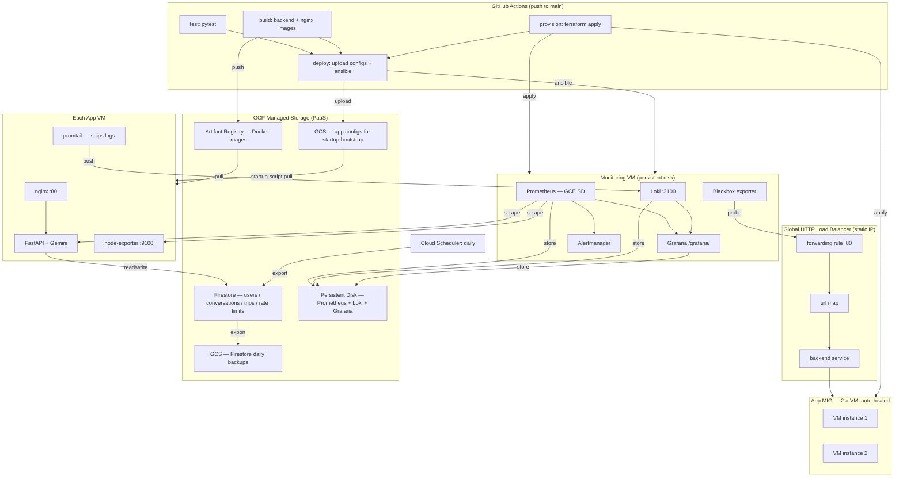

# AI Travel Assistant

A full-stack AI travel assistant powered by Google Gemini Flash, running on GCP.
Infrastructure is provisioned with Terraform, monitoring is provisioned with Ansible,
and a GCP Managed Instance Group keeps the app self-healing behind a global HTTP
load balancer.

Written for the Cloud Computing course — see [`ausarbeitung/`](ausarbeitung/) for the
report (Typst + PDF) and [`presentation/`](presentation/) for the slides.
The chosen focus feature is **disaster recovery**: daily Firestore backups, MIG
auto-healing, and scripted restore — see [Disaster Recovery](#disaster-recovery) below.

## Architecture



### Cloud layers used

| Layer | Services |
|-------|----------|
| **IaaS** | Compute Engine VMs (app MIG + monitoring VM), VPC firewall, persistent disks, global HTTP load balancer |
| **PaaS** | Firestore, Artifact Registry, Cloud Storage, Cloud Scheduler |
| **SaaS** | Gemini API (Google AI Studio) |

### Repo layout

| Path | Purpose |
|------|---------|
| [`backend/`](backend/) | FastAPI app — routers (`auth`, `ai`, `trips`, `health`), Firestore + Gemini services, pytest suite |
| [`frontend/`](frontend/) | React + Vite + Tailwind UI — login, chat, trip planner |
| [`nginx/`](nginx/) | Multi-stage Dockerfile: builds the frontend, serves static files, proxies `/api` to backend |
| [`terraform/`](terraform/) | All GCP infrastructure (VMs, MIG, LB, Firestore, Artifact Registry, GCS, scheduled backup job) |
| [`ansible/`](ansible/) | Monitoring-VM provisioning (Prometheus, Loki, Grafana, Alertmanager) |
| [`monitoring/`](monitoring/) | Monitoring stack configs (dashboards, alert rules, promtail, blackbox) |
| [`scripts/`](scripts/) | VM startup script + disaster-recovery scripts (backup / restore / seed / corrupt-db demo) |
| [`.github/workflows/`](.github/workflows/) | `deploy.yml` (main pipeline) and `terraform-destroy.yml` (teardown) |

## Deployment pipeline

Pushing to `main` triggers [`.github/workflows/deploy.yml`](.github/workflows/deploy.yml):

1. **test** — runs `pytest` against [`backend/tests/`](backend/tests/).
2. **build** (matrix) — builds + pushes `backend` and `nginx` images to Artifact Registry, tagged with `github.sha` and `latest`.
3. **provision** — `terraform apply` creates/updates infra and imports the Firestore DB if it already exists out-of-band.
4. **deploy** — uploads `docker-compose.yml`, promtail config, and a rendered `.env` to the GCS config bucket, re-runs `terraform apply` with the new `app_image_tag` (triggers MIG rolling replacement), and runs Ansible against the monitoring VM.

The app VMs bootstrap themselves from [`scripts/startup.sh`](scripts/startup.sh) — no
Ansible required on the app side. That script runs on every MIG-created instance,
pulls the configs from GCS, and starts the docker-compose stack. This keeps
auto-healing and rolling updates zero-touch.

## First-time setup

### 1. GCP prerequisites

```bash
# Enable required APIs
gcloud services enable \
  compute.googleapis.com \
  firestore.googleapis.com \
  iam.googleapis.com \
  artifactregistry.googleapis.com \
  cloudscheduler.googleapis.com

# GCS bucket for Terraform state
gsutil mb -l europe-west3 gs://YOUR_PROJECT_ID-tf-state

# CI/CD service account
gcloud iam service-accounts create github-actions --display-name="GitHub Actions"

for role in \
  roles/compute.admin \
  roles/cloudscheduler.admin \
  roles/iam.serviceAccountAdmin \
  roles/iam.serviceAccountUser \
  roles/resourcemanager.projectIamAdmin \
  roles/serviceusage.serviceUsageAdmin \
  roles/datastore.owner \
  roles/storage.admin \
  roles/artifactregistry.admin; do
  gcloud projects add-iam-policy-binding YOUR_PROJECT_ID \
    --member="serviceAccount:github-actions@YOUR_PROJECT_ID.iam.gserviceaccount.com" \
    --role="$role"
done

gcloud iam service-accounts keys create sa-key.json \
  --iam-account=github-actions@YOUR_PROJECT_ID.iam.gserviceaccount.com

# Firestore (Native mode)
gcloud firestore databases create --location=europe-west3
```

Notes:
- The GitHub Actions deploy identity is the service account whose JSON key lives in `GCP_SA_KEY`.
- `roles/serviceusage.serviceUsageAdmin` lets Terraform enable APIs such as Cloud Scheduler on the fly.
- `roles/cloudscheduler.admin` is needed so Terraform can create the daily Firestore export job.

### 2. SSH key pair (for Ansible → monitoring VM)

```bash
ssh-keygen -t ed25519 -C "github-actions-deploy" -f deploy_key -N ""
# deploy_key       → GitHub Secret  SSH_PRIVATE_KEY
# deploy_key.pub   → GitHub Variable SSH_PUBLIC_KEY
```

### 3. GitHub Secrets

| Name | Value |
|------|-------|
| `GCP_SA_KEY` | Contents of `sa-key.json` |
| `GEMINI_API_KEY` | Your Gemini API key (Google AI Studio) |
| `JWT_SECRET_KEY` | `openssl rand -hex 32` |
| `GRAFANA_ADMIN_PASSWORD` | Strong password |
| `PROMETHEUS_HTPASSWD` | `htpasswd -nb admin yourpassword` |
| `SSH_PRIVATE_KEY` | Contents of `deploy_key` |

### 4. GitHub Variables

| Name | Value |
|------|-------|
| `GCP_PROJECT_ID` | Your GCP project ID |
| `GCP_REGION` | `europe-west3` |
| `TF_STATE_BUCKET` | `YOUR_PROJECT_ID-tf-state` |
| `SSH_PUBLIC_KEY` | Contents of `deploy_key.pub` |
### 5. Deploy

```bash
git push origin main
```

After the pipeline finishes, the app is reachable at the global static IP printed by
`terraform output app_static_ip`.

## Local development

Backend:

```bash
cd backend
python3.13 -m venv .venv && source .venv/bin/activate
pip install -r requirements.txt -r requirements-test.txt
cp ../.env.example .env   # fill in values
uvicorn main:app --reload
pytest tests/ -v          # run the test suite
```

Frontend:

```bash
cd frontend
npm install
npm run dev
```

### Backend `.env`

| Variable | Required | Purpose |
|----------|----------|---------|
| `GEMINI_API_KEY` | yes | Gemini API key |
| `GCP_PROJECT_ID` | yes | Firestore client project |
| `JWT_SECRET_KEY` | yes | Signs JWTs issued by `/api/auth` |
| `GRAFANA_ADMIN_PASSWORD` | no | Only if running the full monitoring stack locally |
| `MONITORING_MOUNT` | no | Local mount for Prometheus/Grafana data (e.g. `/tmp/monitoring`) |

## Access

| Service | URL |
|---------|-----|
| Frontend | `http://<app_static_ip>/` |
| API docs | `http://<app_static_ip>/api/docs` |
| Grafana | `http://<monitoring_vm_ip>/grafana/` (admin / `GRAFANA_ADMIN_PASSWORD`) |

Prometheus is protected by basic auth and is not meant to be used directly — Grafana is the entry point.

## Firestore collections

| Collection | Contents |
|------------|----------|
| `users/{uid}` | User profiles |
| `users/{uid}/conversations/{id}` | Chat history |
| `users/{uid}/trips/{id}` | Saved itineraries |
| `rate_limits/{uid}` | Gemini API daily usage (resets at midnight UTC) |
| `analytics/daily_usage` | Aggregate request counters |

## Rate limiting

Gemini free tier: **500 requests/day**. Per-user usage is tracked in Firestore using
atomic transactions; users hitting the cap get a 429 with a clear message.

## Disaster recovery

The focus feature. Three layers:

1. **MIG auto-healing** — the app backend service runs an HTTP health check against
   `/api/health` every 30 s. Three consecutive failures (≈90 s) replace the VM. The
   replacement boots, runs [`scripts/startup.sh`](scripts/startup.sh), pulls configs
   from the GCS config bucket, and rejoins the load balancer — no manual steps.
2. **Daily Firestore export** — Cloud Scheduler triggers `projects/.../databases/(default):exportDocuments`
   at 03:00 Europe/Berlin, writing to the `…-firestore-backups` GCS bucket. Exports
   older than 30 days are auto-deleted by a lifecycle rule.
3. **Scripted restore** — operator scripts in [`scripts/`](scripts/):
   - [`firestore-backup.sh`](scripts/firestore-backup.sh) — ad-hoc export
   - [`firestore-restore.sh`](scripts/firestore-restore.sh) — restore from a prior export
   - [`firestore-seed-demo-data.sh`](scripts/firestore-seed-demo-data.sh) — re-seed demo users/trips
   - [`demo-corrupt-db.sh`](scripts/demo-corrupt-db.sh) — destructive demo for the presentation

## Monitoring data persistence

Prometheus, Loki, and Grafana data lives on a dedicated GCP persistent disk
(`travel-assistant-monitoring`) mounted at `/mnt/monitoring-data`. The disk has
`prevent_destroy = true`, so it survives VM restarts, VM recreation, and redeploys.
