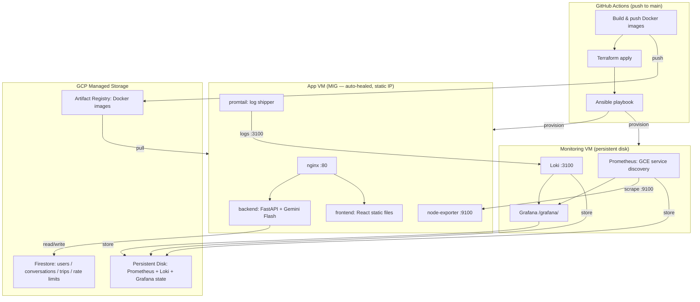

# AI Travel Assistant

A full-stack AI travel assistant powered by Gemini Flash 3, running on a GCP VM managed with Terraform + Ansible.

## Architecture



## First-time Setup

### 1. GCP Prerequisites

```bash
# Enable required APIs
gcloud services enable \
  compute.googleapis.com \
  firestore.googleapis.com \
  iam.googleapis.com \
  artifactregistry.googleapis.com \
  cloudscheduler.googleapis.com

# Create a GCS bucket for Terraform state
gsutil mb -l europe-west3 gs://YOUR_PROJECT_ID-tf-state

# Create a service account for CI/CD
gcloud iam service-accounts create github-actions --display-name="GitHub Actions"

# Grant permissions — all of these are required
for role in \
  roles/compute.admin \
  roles/cloudscheduler.admin \
  roles/iam.serviceAccountAdmin \
  roles/iam.serviceAccountUser \
  roles/resourcemanager.projectIamAdmin \
  roles/serviceusage.serviceUsageAdmin \
  roles/datastore.owner \
  roles/storage.admin \
  roles/firebase.admin \
  roles/artifactregistry.admin; do
  gcloud projects add-iam-policy-binding YOUR_PROJECT_ID \
    --member="serviceAccount:github-actions@YOUR_PROJECT_ID.iam.gserviceaccount.com" \
    --role="$role"
done

# Create + download key
gcloud iam service-accounts keys create sa-key.json \
  --iam-account=github-actions@YOUR_PROJECT_ID.iam.gserviceaccount.com

# Save sa-key.json for github secrets

# Initialize Firestore (choose Native mode)
gcloud firestore databases create --location=europe-west3
```

Important:
- The GitHub Actions deploy identity is the service account whose JSON key is stored in `GCP_SA_KEY`.
- In the example above that is `github-actions@YOUR_PROJECT_ID.iam.gserviceaccount.com`.
- It needs `roles/serviceusage.serviceUsageAdmin` so Terraform can enable APIs such as Cloud Scheduler during deploys.
- It also needs `roles/cloudscheduler.admin` so Terraform can create the scheduled Firestore export job.
- If `cloudscheduler.googleapis.com` is already enabled manually, deploys will also work without that role, but the role is the cleaner long-term setup.

### 2. SSH Key Pair

```bash
ssh-keygen -t ed25519 -C "github-actions-deploy" -f deploy_key -N ""
# deploy_key       → add as GitHub Secret: SSH_PRIVATE_KEY
# deploy_key.pub   → add as GitHub Variable: SSH_PUBLIC_KEY
```

### 3. GitHub Secrets (Settings > Secrets and Variables > Actions)

| Name | Value |
|------|-------|
| `GCP_SA_KEY` | Contents of `sa-key.json` |
| `GEMINI_API_KEY` | Your Gemini API key |
| `JWT_SECRET_KEY` | Random secret for signing JWTs — generate with `openssl rand -hex 32` |
| `GRAFANA_ADMIN_PASSWORD` | Choose a strong password |
| `PROMETHEUS_HTPASSWD` | htpasswd entry for Prometheus basic auth — generate with `htpasswd -nb admin yourpassword` |
| `SSH_PRIVATE_KEY` | Contents of `deploy_key` |
| `FIREBASE_API_KEY` | Firebase Web API Key (from Firebase Console > Project Settings > General) |

### 4. GitHub Variables

| Name | Value |
|------|-------|
| `GCP_PROJECT_ID` | Your GCP project ID |
| `GCP_REGION` | `europe-west3` |
| `TF_STATE_BUCKET` | `YOUR_PROJECT_ID-tf-state` |
| `SSH_PUBLIC_KEY` | Contents of `deploy_key.pub` |
| `FIREBASE_APP_ID` | From Firebase Console > Project Settings > General |
| `FIREBASE_STORAGE_BUCKET` | From Firebase Console — usually `YOUR_PROJECT_ID.firebasestorage.app` |
| `FIREBASE_MESSAGING_SENDER_ID` | From Firebase Console > Project Settings > General |

### 5. Firebase Setup

1. Go to [Firebase Console](https://console.firebase.google.com) > Add project (use your existing GCP project)
2. Enable Authentication > Sign-in method > Google
3. Add a Web app and copy the config values to `frontend/.env` (for local dev)
4. The `VITE_FIREBASE_*` values need to be baked into the frontend Docker build.
   Add them to the Ansible env.j2 template or build them into the image in CI.

### 6. Deploy

```bash
git add -A && git commit -m "initial deploy" && git push origin main
```

The GitHub Actions workflow will:
1. Run `terraform apply` (creates VM if not exists)
2. Get the VM IP from Terraform output
3. Run Ansible to provision the VM and start all services

## Local Development

```bash
# Backend
cd backend
pip install -r requirements.txt
cp ../.env.example .env  # fill in values
uvicorn main:app --reload

# Frontend
cd frontend
npm install
npm run dev
```

### Backend `.env` variables

| Variable | Required | Description |
|----------|----------|-------------|
| `GEMINI_API_KEY` | Yes | Your Gemini API key |
| `GCP_PROJECT_ID` | Yes | GCP project ID (used by Firestore client) |
| `JWT_SECRET_KEY` | Yes | Random secret for signing JWTs |
| `GRAFANA_ADMIN_PASSWORD` | No | Only needed when running full stack locally |
| `MONITORING_MOUNT` | No | Local path for Prometheus/Grafana data (e.g. `/tmp/monitoring`) |

## Accessing Services

| Service | URL |
|---------|-----|
| Frontend | `http://YOUR_VM_IP/` |
| API docs | `http://YOUR_VM_IP/api/docs` |
| Grafana | `http://YOUR_VM_IP/grafana/` (admin / your password) |

Prometheus is internal-only and not exposed publicly.

## Monitoring Data Persistence

Prometheus and Grafana data is stored on a **separate GCP Persistent Disk** (`travel-assistant-monitoring`).
This disk is protected with `prevent_destroy = true` in Terraform and will survive:
- VM restarts
- VM recreation
- Redeployments

The disk is mounted to `/mnt/monitoring-data` on the VM.

## Firestore Collections

| Collection | Contents |
|------------|----------|
| `users/{uid}` | User profiles |
| `users/{uid}/conversations/{id}` | Chat history |
| `users/{uid}/trips/{id}` | Saved itineraries |
| `rate_limits/{uid}` | Gemini API daily usage (resets at midnight UTC) |
| `analytics/daily_usage` | Aggregate request counters |

## Rate Limiting

Gemini Flash free tier: **500 requests/day**. Usage is tracked per-user in Firestore with atomic transactions. Users hitting the limit get a clear 429 error message.
