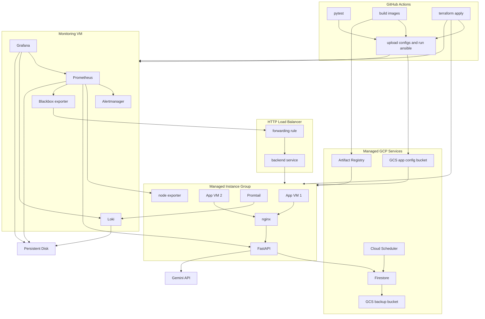

# AI Travel Assistant

A full-stack AI travel assistant powered by Google Gemini Flash, running on GCP. The app now includes a richer planning workflow (structured itineraries, conversation management, trip detail/edit/export), while the primary project focus remains on infrastructure.
Infrastructure is provisioned with Terraform, monitoring is provisioned with Ansible, and a GCP Managed Instance Group keeps the app self-healing behind a global HTTP load balancer.

Written for the Cloud Computing course — see [`ausarbeitung/`](ausarbeitung/) for the report (Typst + PDF) and [`presentation/`](presentation/) for the slides.
The chosen focus feature is **disaster recovery**: daily Firestore backups, MIG auto-healing, and workflow-supported restore — see [Disaster Recovery](#disaster-recovery) below.

## Architecture



### Cloud layers used

| Layer | Services |
|-------|----------|
| **IaaS** | Compute Engine VMs (app MIG + monitoring VM), VPC firewall, persistent disks, global HTTP load balancer |
| **PaaS** | Firestore, Artifact Registry, Cloud Storage, Cloud Scheduler |
| **SaaS** | Gemini API (Google AI Studio) |

### Repo layout

| Path | Purpose |
|------|---------|
| [`backend/`](backend/) | FastAPI app — routers (`auth`, `ai`, `trips`, `health`), strict Gemini envelope handling, Firestore + Gemini services, pytest suite |
| [`frontend/`](frontend/) | React + Vite + Tailwind UI — login, AI chat, conversation history management, trip planner + trip detail/editor |
| [`nginx/`](nginx/) | Multi-stage Dockerfile: builds the frontend, serves static files, proxies `/api` to backend |
| [`terraform/`](terraform/) | All GCP infrastructure (VMs, MIG, LB, Firestore, Artifact Registry, GCS, scheduled backup job) |
| [`ansible/`](ansible/) | Monitoring-VM provisioning (Prometheus, Loki, Grafana, Alertmanager) |
| [`monitoring/`](monitoring/) | Monitoring stack configs (dashboards, alert rules, promtail, blackbox) |
| [`scripts/`](scripts/) | Infrastructure helper scripts, including VM startup/bootstrap |
| [`presentation/`](presentation/) | Reveal.js deck and local demo scripts for backup/restore/corruption scenarios |
| [`.github/workflows/`](.github/workflows/) | `deploy.yml` (main pipeline with post-deploy verification), `integration-tests.yml` (reusable/manual deployed-app integration tests), `firestore-manual-backup.yml` / `firestore-manual-restore.yml` (manual Firestore export/import), and `terraform-destroy.yml` (teardown) |

## Deployment pipeline

Pushing to `main` triggers [`.github/workflows/deploy.yml`](.github/workflows/deploy.yml):

1. **backend_checks** — runs ruff lint/format, mypy, pip-audit, and `pytest` against [`backend/tests/`](backend/tests/).
2. **frontend_checks** — runs TypeScript checks, ESLint, Vitest frontend tests with coverage, and `npm audit`.
3. **build** (matrix) — builds + pushes `backend` and `nginx` images to Artifact Registry, tagged with `github.sha` and `latest`.
4. **provision** — `terraform apply` creates/updates infra, imports the Firestore DB if it already exists out-of-band, and seeds required Firestore sentinel documents.
5. **deploy** — uploads `docker-compose.yml`, promtail config, and a rendered `.env` to the GCS config bucket, re-runs `terraform apply` with the new `app_image_tag` (triggers MIG rolling replacement), and runs Ansible against the monitoring VM.
6. **verify** — calls the integration-test workflow against the public app URL after deployment.

Integration checks live in [`.github/workflows/integration-tests.yml`](.github/workflows/integration-tests.yml). The workflow runs automatically as post-deploy verification and can also be started manually with `workflow_dispatch`. It takes the deployed app URL as input, skips Gemini to avoid quota/cost flakiness, creates a unique temporary user/trip through the public API, checks health endpoints and storage buckets, and cleans up Firestore test data in an `if: always()` step. Sentinel documents are provisioned separately during infrastructure setup.

Current test coverage:

| Area | Tool | Command | Line coverage |
|------|------|---------|---------------|
| Backend | `pytest-cov` | `pytest tests/ --cov` | 96% |
| Frontend | Vitest + V8 coverage | `npm run test:coverage` | 74.83% |

The app VMs bootstrap themselves from [`scripts/startup.sh`](scripts/startup.sh) — no
Ansible required on the app side. That script runs on every MIG-created instance,
pulls the configs from GCS, and starts the docker-compose stack. This keeps
auto-healing and rolling updates zero-touch.

## First-time setup

### 1. GCP prerequisites

```bash
# Create project
gcloud projects create YOUR_PROJECT_ID --name="Travel Assistant"

# Switch gcloud context to the project
gcloud config set project YOUR_PROJECT_ID

# Enable billing for the project
gcloud beta billing projects link YOUR_PROJECT_ID \
  --billing-account=YOUR_BILLING_ACCOUNT_ID

# Enable required APIs
gcloud services enable \
  cloudresourcemanager.googleapis.com \
  compute.googleapis.com \
  firestore.googleapis.com \
  iam.googleapis.com \
  artifactregistry.googleapis.com \
  cloudscheduler.googleapis.com

# GCS bucket for Terraform state
gsutil mb -l europe-west3 gs://YOUR_PROJECT_ID-tf-state

# CI/CD service account
gcloud iam service-accounts create github-actions --display-name="GitHub Actions"

for role in \
  roles/compute.admin \
  roles/cloudscheduler.admin \
  roles/iam.serviceAccountAdmin \
  roles/iam.serviceAccountUser \
  roles/resourcemanager.projectIamAdmin \
  roles/serviceusage.serviceUsageAdmin \
  roles/datastore.owner \
  roles/storage.admin \
  roles/artifactregistry.admin \
  roles/secretmanager.admin; do
  gcloud projects add-iam-policy-binding YOUR_PROJECT_ID \
    --member="serviceAccount:github-actions@YOUR_PROJECT_ID.iam.gserviceaccount.com" \
    --role="$role"
done

gcloud iam service-accounts keys create sa-key.json \
  --iam-account=github-actions@YOUR_PROJECT_ID.iam.gserviceaccount.com
```

Notes:
- The GitHub Actions deploy identity is the service account whose JSON key lives in `GCP_SA_KEY`.
- `roles/serviceusage.serviceUsageAdmin` lets Terraform enable APIs such as Cloud Scheduler on the fly.
- `roles/cloudscheduler.admin` is needed so Terraform can create the daily Firestore export job.
- Firestore `(default)` is managed by Terraform in this project; no separate manual `gcloud firestore databases create` step is required for fresh projects.

### 2. SSH key pair (for Ansible → monitoring VM)

```bash
ssh-keygen -t ed25519 -C "github-actions-deploy" -f deploy_key -N ""
# deploy_key       → GitHub Secret  SSH_PRIVATE_KEY
# deploy_key.pub   → GitHub Variable SSH_PUBLIC_KEY
```

### 3. GitHub Secrets

| Name | Value |
|------|-------|
| `GCP_SA_KEY` | Contents of `sa-key.json` |
| `GEMINI_API_KEY` | Your Gemini API key (Google AI Studio) |
| `JWT_SECRET_KEY` | `openssl rand -hex 32` |
| `GRAFANA_ADMIN_PASSWORD` | Strong password |
| `PROMETHEUS_HTPASSWD` | `htpasswd -nb admin yourpassword` |
| `SSH_PRIVATE_KEY` | Contents of `deploy_key` |
| `SMTP_AUTH_PASSWORD` | Optional SMTP password/app password for Alertmanager email notifications |

Required IAM rights for `GCP_SA_KEY` (service account `github-actions@<project>.iam.gserviceaccount.com`):
- `roles/compute.admin` — create/update instance templates, MIG, load balancer resources, disks, and VM metadata.
- `roles/cloudscheduler.admin` — create/update the Firestore export schedule.
- `roles/iam.serviceAccountAdmin` — manage service-account-related IAM bindings used by Terraform resources.
- `roles/iam.serviceAccountUser` — allow resources/workflows to impersonate or attach service accounts where needed.
- `roles/resourcemanager.projectIamAdmin` — manage project-level IAM bindings applied by Terraform.
- `roles/serviceusage.serviceUsageAdmin` — enable required APIs during provisioning.
- `roles/datastore.owner` — manage Firestore database and export/import operations.
- `roles/storage.admin` — manage Terraform state bucket, app-config bucket objects, and Firestore backup bucket objects.
- `roles/artifactregistry.admin` — create/manage repositories and push/pull container images.
- `roles/secretmanager.admin` — create the Secret Manager secrets (`gemini-api-key`, `jwt-secret-key`) and push new versions during deploy.

### 4. GitHub Variables

| Name | Value |
|------|-------|
| `GCP_PROJECT_ID` | Your GCP project ID |
| `GCP_REGION` | `europe-west3` |
| `TF_STATE_BUCKET` | `YOUR_PROJECT_ID-tf-state` |
| `SSH_PUBLIC_KEY` | Contents of `deploy_key.pub` |
| `SMTP_SMARTHOST` | Optional SMTP host and port, e.g. `smtp.gmail.com:587` |
| `SMTP_FROM` | Optional sender address for alert emails, e.g. `alerts@example.com` |
| `SMTP_AUTH_USERNAME` | Optional SMTP login user, often the same as `SMTP_FROM` |
| `ALERT_EMAIL_TO` | Optional recipient address for alert emails |

If the SMTP values are omitted, Alertmanager still groups and tracks alerts, but
does not send email notifications. When configured, alert emails originate from
the Alertmanager container on the monitoring VM via `SMTP_SMARTHOST`, authenticate
as `SMTP_AUTH_USERNAME`, use `SMTP_FROM` as sender, and deliver to
`ALERT_EMAIL_TO`.

### 5. Deploy

```bash
git push origin main
```

After the pipeline finishes, the app is reachable at the global static IP printed by
`terraform output app_static_ip`.

## Local development

Backend:

```bash
cd backend
python3.13 -m venv .venv && source .venv/bin/activate
pip install -r requirements.txt -r requirements-test.txt
cp ../.env.example .env   # fill in values
uvicorn main:app --reload
pytest tests/ -v          # run the test suite
```

Gemini integration tests (real API calls):

```bash
cd backend
source .venv/bin/activate
pytest tests/integration/test_gemini.py -m integration -v
```

Notes:
- These tests call Gemini directly and may consume quota/cost.
- They bypass Firestore rate-limit bookkeeping to keep scope on Gemini behavior.

Frontend:

```bash
cd frontend
npm install
npm run dev
npm run test:run       # run frontend tests
npm run test:coverage  # run tests and print coverage; writes frontend/coverage/
npm run typecheck      # TypeScript check
```

### Backend `.env`

| Variable | Required | Purpose |
|----------|----------|---------|
| `GEMINI_API_KEY` | yes | Gemini API key |
| `GCP_PROJECT_ID` | yes | Firestore client project |
| `JWT_SECRET_KEY` | yes | Signs JWTs issued by `/api/auth` |
| `GRAFANA_ADMIN_PASSWORD` | no | Only if running the full monitoring stack locally |
| `MONITORING_MOUNT` | no | Local mount for Prometheus/Grafana data (e.g. `/tmp/monitoring`) |
| `SMTP_SMARTHOST` | no | Optional SMTP server for Alertmanager email notifications |
| `SMTP_FROM` | no | Optional sender address for alert emails |
| `SMTP_AUTH_USERNAME` | no | Optional SMTP username |
| `SMTP_AUTH_PASSWORD` | no | Optional SMTP password/app password |
| `ALERT_EMAIL_TO` | no | Optional alert email recipient |
| `GEMINI_MODEL` | no | Default Gemini model (fallback: `gemini-3.1-flash-lite-preview`) |
| `GEMINI_REASONING_MODEL` | no | Alternate reasoning model (fallback: `gemini-2.5-flash`) |
| `GEMINI_USE_REASONING` | no | Set to `1` to use `GEMINI_REASONING_MODEL` |

## Access

| Service | URL |
|---------|-----|
| Frontend | `http://<app_static_ip>/` |
| API docs | `http://<app_static_ip>/api/docs` |
| Grafana | `http://<monitoring_vm_ip>/grafana/` (admin / `GRAFANA_ADMIN_PASSWORD`) |

Prometheus is protected by basic auth and is not meant to be used directly — Grafana is the entry point.
Alertmanager is available at `http://<monitoring_vm_ip>/alertmanager/` and can
send email notifications when the optional SMTP settings are configured.

## Firestore collections

| Collection | Contents |
|------------|----------|
| `users/{uid}` | User profiles |
| `users/{uid}/conversations/{id}` | Chat history + metadata (`title`, `trip_title`, `recommendations`, `updated_at`) |
| `users/{uid}/trips/{id}` | Saved trips with optional structured itinerary JSON (`itinerary`) and linked `conversation_id` |
| `rate_limits/{uid}` | Gemini API daily usage (resets at midnight UTC) |
| `analytics/daily_usage` | Aggregate request counters |

## Rate limiting

Gemini free tier: **500 requests/day**. Per-user usage is tracked in Firestore using
atomic transactions; users hitting the cap get a 429 with a clear message.

## App upgrade scope (frontend + backend)

### Backend changes

- `POST /api/ai/chat` now enforces a strict Gemini JSON envelope with exactly `triptitle`, `response`, and `recommendations`.
- If Gemini violates that contract, backend retries once with a repair instruction; if it still fails, the API returns `502` with trimmed raw-response diagnostics.
- Chat responses now return `recommendations` (2-4 follow-up prompts) and optional `trip_plan` JSON for structured itinerary rendering.
- Conversation API now supports rename/delete (`PATCH /api/ai/conversations/{id}`, `DELETE /api/ai/conversations/{id}`), while list/get remain unchanged.
- Trip API now includes `GET /api/trips/{trip_id}` in addition to list/create/update/delete.
- Gemini chat prompt runs as a two-phase flow: preference discovery first, itinerary generation after the user sends `GO`.

### Frontend changes

- Chat UI now includes recommendation chips, retry for failed requests, search/sort/pin for conversation history, rename/delete actions, and a mobile history drawer.
- Structured itinerary JSON is rendered as timeline cards (days, activities, hotels by night, budget).
- Assistant responses can be saved as trips; when a conversation already has a linked trip, itinerary changes can be written back via update.
- Markdown export is available for generated/saved itineraries.
- Trip planner now includes search/sort, per-trip export/delete actions, detail navigation, and jump-to-linked-chat.
- New `TripDetail` route (`/trips/:tripId`) supports full trip view/edit/save/delete, structured itinerary editing, export, and opening the linked conversation.

## Disaster recovery

The focus feature. Three layers:

1. **MIG auto-healing** — the app backend service runs an HTTP health check against
   `/api/health` every 30 s. Three consecutive failures (≈90 s) replace the VM. The
   replacement boots, runs [`scripts/startup.sh`](scripts/startup.sh), pulls configs
   from the GCS config bucket, and rejoins the load balancer — no manual steps.
2. **Daily Firestore export** — Cloud Scheduler triggers `projects/.../databases/(default):exportDocuments`
   at 03:00 Europe/Berlin, writing to the `…-firestore-backups` GCS bucket. Exports
   older than 30 days are auto-deleted by a lifecycle rule.
3. **Manual backup** — the `Manual Firestore Backup` GitHub Action can be started with `workflow_dispatch` and writes exports to `gs://<project-id>-firestore-backups/manual/...`.
4. **Manual restore** — the `Manual Firestore Restore` GitHub Action can be started with `workflow_dispatch`; it restores either a provided `gs://` backup URI or the latest manual backup after an explicit `RESTORE` confirmation.
5. **Demo scripts** — presentation demo scripts in [`presentation/demo-scripts/`](presentation/demo-scripts/):
   - [`firestore-backup.sh`](presentation/demo-scripts/firestore-backup.sh) — ad-hoc export
   - [`firestore-restore.sh`](presentation/demo-scripts/firestore-restore.sh) — restore from a prior export
   - [`seed-sentinel-data.sh`](scripts/seed-sentinel-data.sh) — seed Firestore sentinel/reference documents for integrity checks (database setup)
   - [`demo-corrupt-db.sh`](presentation/demo-scripts/demo-corrupt-db.sh) — destructive demo for the presentation

### Recovery-time measurements

Both recovery paths have reproducible `workflow_dispatch` GitHub Actions that emit JSON result artifacts.

- [`perf-mig-recovery.yml`](.github/workflows/perf-mig-recovery.yml) — stops one App VM per iteration and measures MIG autohealing duration (median across 5 iterations: **~498 s ≈ 8 min 18 s**, of which ~21 s MIG replace trigger + ~370 s VM boot + ~107 s app bootstrap). Inputs: `iterations`, `poll_interval`, `cooldown_seconds`, `timeout_minutes`.
- [`perf-dr-scale-test.yml`](.github/workflows/perf-dr-scale-test.yml) — sweeps a comma-separated list of document counts, seeds an isolated Firestore collection, exports it, deletes it, re-imports it, and verifies the restored count. Inputs: `doc_counts` (e.g. `1000,10000,100000`), `iterations`. Measurement at 100 000 docs: ~8 s export, ~563 s import — import dominates and scales linearly at ~5.6 ms/doc.

Result JSON is emitted inline in the "Emit result JSON" step between `<<<PERF_JSON>>>` markers and also uploaded as a workflow artifact. [`scripts/perf-plot.py`](scripts/perf-plot.py) turns either JSON file into a PNG:

```bash
python scripts/perf-plot.py --input perf-mig.json   --output perf-mig.png
python scripts/perf-plot.py --input perf-scale.json --output perf-scale.png
```

## Monitoring data persistence

Prometheus, Loki, and Grafana data lives on a dedicated GCP persistent disk (`travel-assistant-monitoring`) mounted at `/mnt/monitoring-data`. In production, Terraform `prevent_destroy` would be useful to protect this disk from accidental deletion. In this project it is not permanently enabled, so the disk can be removed after the course project without an extra Terraform state intervention.
